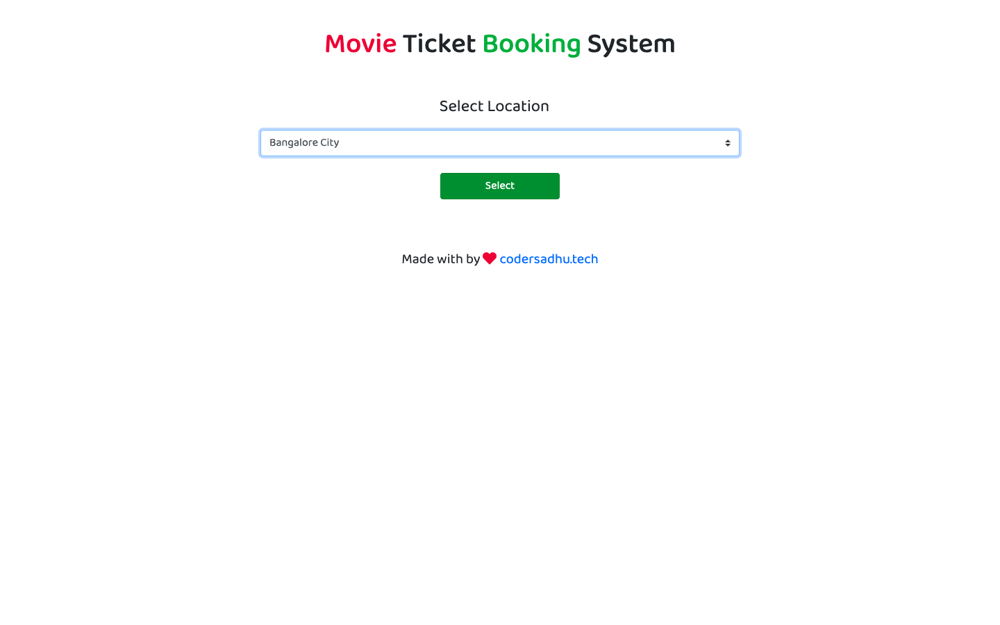
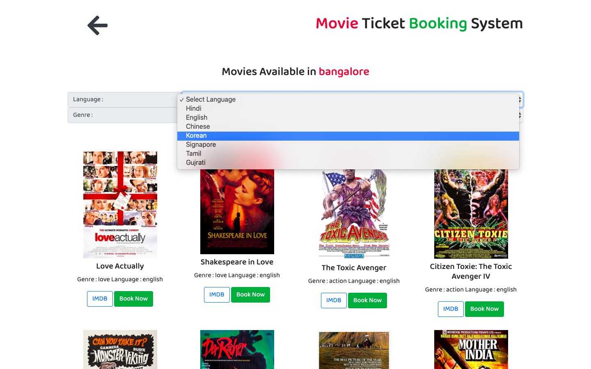
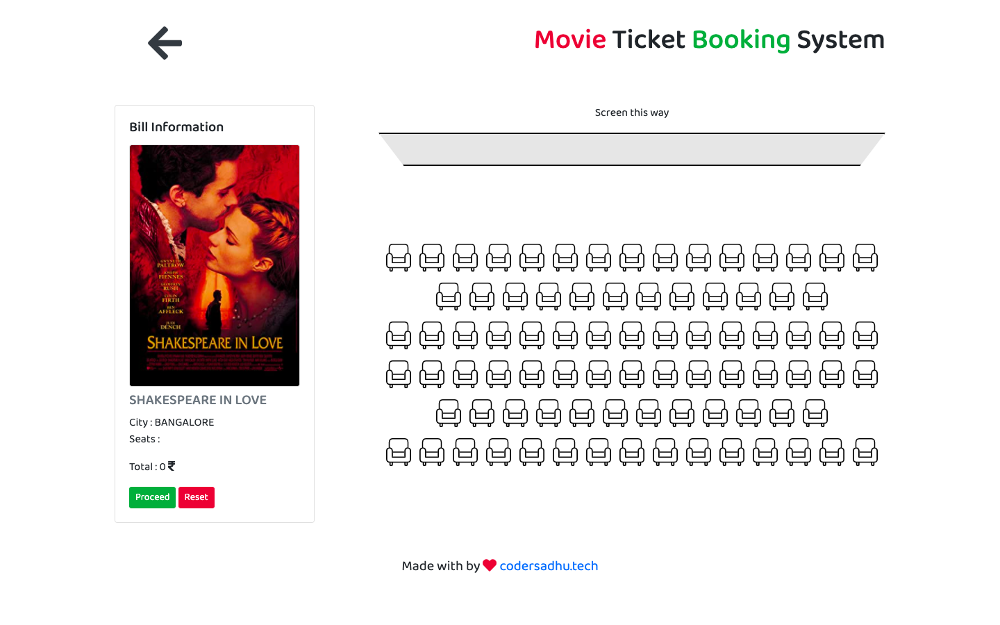
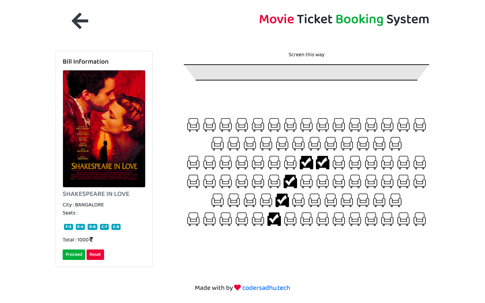
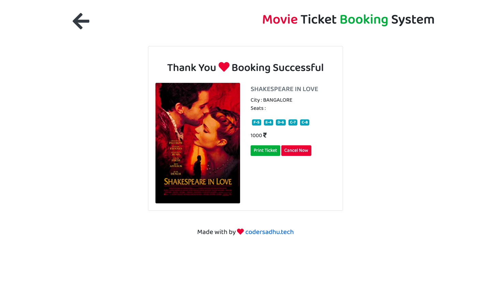

# ticketing-system 

### Movie Ticket System

- [x] frontend  - Netlify
- [x] Json Server - Heroku

## Problem Statement

Design and develop a ticketing system. 
The system should allow user to select movies from a list. Allow them to select seats. Filter the movies by genre and language. Bonus points for filtering the list by taking user location to the theatre destination. (Assume arbitrary location) 

 
Skip through payment process but ensure the final screen has the details of the movie booked with an option to cancel.

## Demo Link
Open Here  - 
[ **Demo** ](https://ticket-system-thinkify.netlify.com/)

### Tech / Stack:

 HTML5
 CSS3 
 JavaScript
 BootStrap
 
### Features implemented:
- [x] movies by Location
- [x] Filter by genre and language.
- [x] Select Movie & check details
- [x] Select Seats & get Price
- [x] Reset selection
- [x] Confirm Bookings
- [x] Print Tickets

Step 1 : 

Step 2 : 
 

Step 3 : 
 

Step 4 : 
 

Step 5 : 
 

